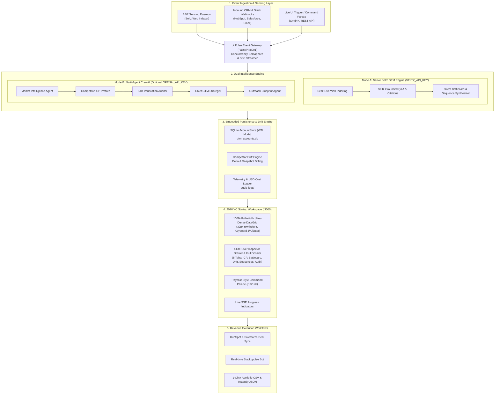

<div align="center">

# ⚡ Pulse: Autonomous GTM Operating System

### *The Always-On Market Sensing & Revenue Intelligence Engine*

[](https://www.python.org/)
[](https://github.com/astral-sh/uv)
[](https://nextjs.org/)
[](https://tailwindcss.com/)
[](https://seltz.ai)
[](https://crewai.com)
[](https://fastapi.tiangolo.com)
[](tests/)
[](LICENSE)

<br/>

**Pulse** is a production-grade, event-driven **Autonomous Go-To-Market (GTM) Operating System**. Built with a **Dual Intelligence Engine** (native **Seltz AI** grounded indexing + optional **CrewAI** multi-agent reasoning) and an authentic **2026 YC-grade Dark Monochrome Workspace** (Linear / Raycast / Clay style), Pulse continuously senses competitor moves 24/7, verifies assertions against raw web citations, detects pricing and tech stack drift, and automatically drives revenue workflows across CRM, Slack, and Apollo outbound campaigns.

</div>

---

## 📑 Table of Contents

- [🌟 Why Pulse?](#-why-pulse)
- [🏗️ System Architecture](#️-system-architecture)
- [⚡ Dual Intelligence Engine (Seltz Native + CrewAI)](#-dual-intelligence-engine)
- [🖥️ 2026 YC-Grade Frontend Workspace](#️-2026-yc-grade-frontend-workspace)
- [🚀 Quick Start Guide](#-quick-start-guide)
  - [1. Backend Setup (`uv`)](#1-backend-setup-uv)
  - [2. Frontend Setup (`Next.js 14`)](#2-frontend-setup-nextjs-14)
  - [3. Environment Configuration](#3-environment-configuration)
- [📡 Event Gateway & REST API (FastAPI)](#-event-gateway--rest-api-fastapi)
  - [Real-time SSE Event Streaming](#real-time-sse-event-streaming)
  - [Account Store & Drift Endpoints](#account-store--drift-endpoints)
- [⏰ 24/7 Background Sensing Daemon](#-247-background-sensing-daemon)
- [🔗 Integrations & Revenue Workflows](#-integrations--revenue-workflows)
- [🧪 Verification & Test Suite](#-verification--test-suite)
- [📁 Project Structure](#-project-structure)
- [📄 License](#-license)

---

## 🌟 Why Pulse?

Most GTM intelligence tools fail for three core reasons:
1. **Passive Dashboards**: Reps and founders must remember to log in, read paragraphs, and copy-paste text. After two weeks, usage drops to zero.
2. **Hallucination Risk**: Generic LLMs invent competitor features, pricing tiers, and compliance claims, ruining deal credibility during live executive pitches.
3. **Point-in-Time Stale Reports**: Competitor pricing, positioning, and hiring change weekly, but static reports sit untouched for months.

### How Pulse Solves This:
* **Always-On Sensing (24/7 Daemon)**: Monitors target competitors continuously using real-time machine web indexing via **Seltz AI**.
* **Zero-Hallucination Moat**: A dedicated `FactCheckerAuditor` audits every competitive assertion against raw source citations. Claims without verified URLs are flagged or rejected.
* **Closed-Loop Automated Actions**: Injects battlecards directly into active CRM deals, pushes drift alerts to Slack, and exports multi-channel Apollo / Instantly campaigns in one click.
* **Dual Execution Flexibility**: Runs 100% on **`SELTZ_API_KEY`** with zero external LLM dependencies, while seamlessly supporting OpenAI / Claude / Gemini when advanced multi-agent role-playing is desired.

---

## 🏗️ System Architecture



---

## ⚡ Dual Intelligence Engine

Pulse provides a battle-tested architecture that eliminates hard external dependencies:

| Feature | Native Seltz Engine (`SeltzGTMEngine`) | Multi-Agent CrewAI Mode |
| :--- | :--- | :--- |
| **Required Key** | `SELTZ_API_KEY` only | `OPENAI_API_KEY` (+ `SELTZ_API_KEY`) |
| **Execution Latency** | **Fast** (~3-8s) | Deep Multi-Agent (~25-45s) |
| **Web Indexing** | Live Seltz API (`/v1/search` & `/v1/answer`) | Seltz Search & Grounded Answer Tools |
| **Offline Resiliency** | DuckDuckGo fallback when offline | DuckDuckGo fallback when offline |
| **Outputs** | Structured Dossier, Battlecards, 3-Step Sequences, Cited URLs | Multi-agent dialogue, reflection & markdown blueprint |

---

## 🖥️ 2026 YC-Grade Frontend Workspace

Designed with the restraint and keyboard ergonomics of **Linear**, **Raycast**, and **Clay**:

* **Zero AI Slop**: Strict dark monochrome palette (`#090A0C` canvas, `#101114` surfaces, `#1F2127` borders, high-contrast white `#F4F4F6` typography). No distracting purple blobs, neon glows, or muddy colors.
* **100% Full-Width Ultra-Dense Data Grid**: 32px row heights showing 25+ accounts above the fold, subtle inline 40px micro-bars for ICP fit scores, and multi-row selection for batch actions.
* **Slide-Over Inspector & Executive Dossier**: Clicking an account opens a sleek slide-over drawer with a subtle backdrop. Click **"Expand to Full Page Dossier"** (`Maximize2` icon) to expand the intelligence into a full-screen executive dashboard.
* **5 Specialized Intelligence Tabs**:
  1. **Overview & ICP Profile**: ARR, headcount, key decision makers with LinkedIn status, pain points, and buying triggers.
  2. **Battlecard Studio**: Win themes, differentiators, objection handlers with 1-click clipboard copy, and discovery landmines.
  3. **Drift & Radar Feed**: Historical delta feed showing price changes, hiring surges, and new competitors.
  4. **Outreach & Sequences**: 3-step cold sequence (Email + LinkedIn) with 1-click Apollo CSV export.
  5. **Telemetry & Audit Moat**: Quality grade (A/B/C), grounding score, clickable real source URLs, and token cost in USD.
* **Keyboard-First Workflow**:
  - `J` / `K` or `↓` / `↑`: Navigate account rows
  - `Enter` / `Space`: Open Account Inspector
  - `Esc`: Close Inspector Drawer
  - `⌘K` / `Ctrl+K`: Open Raycast-style Command Palette

---

## 🚀 Quick Start Guide

### 1. Backend Setup (`uv`)

Pulse uses [uv](https://github.com/astral-sh/uv), the ultra-fast Python package manager:

```bash
# Clone the repository
git clone https://github.com/Saumojit30/Pulse.git
cd Pulse

# Sync virtual environment and dependencies
uv sync

# Run all 27 automated tests
uv run pytest tests/

# Start the Pulse FastAPI server on port 8001
uv run python main.py
```
> The backend will be live at `http://127.0.0.1:8001` with interactive Swagger docs at `http://127.0.0.1:8001/docs`.

### 2. Frontend Setup (`Next.js 14`)

In a separate terminal:

```bash
cd frontend

# Install Node dependencies
npm install

# Start the development server
npm run dev
```
> Open `http://localhost:3000` in your browser to access the Pulse Workspace.

### 3. Environment Configuration

Copy `.env.example` to `.env`:
```bash
cp .env.example .env
```

```env
# Seltz Web Indexing API Key (https://seltz.ai) - REQUIRED for live web searches
SELTZ_API_KEY=your_seltz_api_key_here

# LLM Provider Key (Optional: enables CrewAI multi-agent reasoning mode)
OPENAI_API_KEY=your_openai_api_key_here

# Slack Webhook URL (Optional: for real-time deal alerts)
SLACK_WEBHOOK_URL=https://hooks.slack.com/services/...
```

> **Note**: Even without any API keys, Pulse features an integrated offline search fallback (DuckDuckGo) and heuristic synthesis so you can test the full system out of the box.

---

## 📡 Event Gateway & REST API (FastAPI)

Pulse runs on port `8001` (to prevent collisions with existing services on `8000`):

### Real-time SSE Event Streaming

#### `POST /api/v1/scan/jobs`
Creates an asynchronous scan job and returns `202 Accepted` with a unique `job_id` to eliminate HTTP 504 timeouts.

#### `GET /api/v1/scan/jobs/{job_id}/stream`
Streams live SSE events directly to the frontend:
```text
event: step_start
data: {"step": "web_intelligence", "message": "Seltz Web Indexing live search for 'datadog.com'..."}

event: tool_call
data: {"tool": "SeltzSearchTool", "citations_extracted_count": 4, "citations": ["https://datadog.com/pricing"]}

event: fact_audit
data: {"grade": "A", "overall_score": 0.95, "grounding_score": 0.96}

event: job_completed
data: {"status": "SUCCESS", "target_domain": "datadog.com", "quality_grade": "A"}
```

### Account Store & Drift Endpoints

| Method | Endpoint | Description |
| :--- | :--- | :--- |
| `GET` | `/health` | System health, version, and active indexing engine mode |
| `GET` | `/api/v1/accounts` | Retrieve all persistent accounts from SQLite store |
| `POST` | `/api/v1/accounts` | Create/update an account in persistent SQLite store |
| `DELETE` | `/api/v1/accounts/{id}` | Remove an account from persistent SQLite store |
| `GET` | `/api/v1/drift/{domain}` | Retrieve historical pricing, tech stack, and feature drift |
| `GET` | `/api/v1/audit/logs` | Paginated JSON audit execution traces with token/USD costs |
| `POST` | `/api/v1/crm/webhook` | Ingest deal-stage updates from HubSpot/Salesforce |
| `POST` | `/api/v1/slack/command` | Respond to `/pulse intel <domain>` Slack slash commands |

---

## ⏰ 24/7 Background Sensing Daemon

Pulse includes an asynchronous background daemon (`src/gtm_intelligence/workers/daemon.py`) that monitors watchlists and saves snapshots into the SQLite drift database:

```python
from gtm_intelligence.workers.daemon import PulseSensingDaemon

daemon = PulseSensingDaemon(
    watchlist=["datadog.com", "snowflake.com", "okta.com"],
    check_interval_seconds=86400  # 24 hours
)

# Run a single cycle or run_forever() in background
results = daemon.run_single_cycle()
```

---

## 🔗 Integrations & Revenue Workflows

### 1. HubSpot & Salesforce CRM Sync
When an opportunity is tagged with a competitor in your CRM, Pulse automatically constructs a battlecard note and attaches it to the deal record:
```python
from gtm_intelligence.integrations.crm_sync import CRMSyncEngine, CRMDealWebhookPayload

deal = CRMDealWebhookPayload(
    deal_id="deal_98412",
    deal_name="Enterprise Migration",
    deal_stage="Proposal",
    deal_amount_usd=120000.0,
    competitor_tagged="Datadog"
)
engine = CRMSyncEngine()
payload = engine.process_deal_event(deal)
```

### 2. Apollo.io & Instantly CSV Export
Export targeted 3-step cold sequences directly from the Data Grid or Inspector into standard Apollo CSV format (`First Name`, `Last Name`, `Company`, `Email`, `Sequence Step 1`, `Sequence Step 2`).

### 3. Interactive Slack Bot
Enables sales reps to request instant battlecards:
```bash
/pulse intel acmecloud.io
/pulse drift snowflake.com
```

---

## 🧪 Verification & Test Suite

The test suite includes 27 comprehensive unit and integration tests covering SQLite WAL locking, SSE streams, Seltz tool resilience, circuit breakers, and factuality scoring:

```bash
uv run pytest tests/
```

```text
tests/test_api.py .......                                 [ 25%]
tests/test_daemon.py ..                                   [ 33%]
tests/test_drift_engine.py ...                            [ 44%]
tests/test_integrations.py ...                            [ 55%]
tests/test_logging_and_evaluation.py ..                   [ 62%]
tests/test_robustness.py .....                            [ 81%]
tests/test_seltz_engine.py ...                            [ 92%]
tests/test_seltz_tool.py ..                               [100%]

======================= 27 passed in 14.71s =======================
```

---

## 📁 Project Structure

```
Pulse/
├── main.py                                # API runner script (port 8001)
├── pyproject.toml                         # Python dependencies & pytest config
├── README.md                              # Complete production documentation
├── .gitignore                             # Comprehensive secrets & artifact exclusions
├── .env.example                           # Sample environment configuration
├── src/
│   └── gtm_intelligence/
│       ├── api/
│       │   └── server.py                  # FastAPI Event Gateway, SSE streaming, CRUD
│       ├── engine/
│       │   └── seltz_engine.py            # Native Seltz GTM Intelligence Engine
│       ├── storage/
│       │   ├── account_store.py           # Persistent SQLite Account Store (WAL mode)
│       │   └── drift_engine.py            # Competitor Drift & Delta Engine (SQLite)
│       ├── tools/
│       │   └── seltz_tool.py              # Seltz Web Indexing & Circuit Breaker
│       ├── crew.py                        # CrewAI Multi-Agent Orchestration
│       ├── workers/
│       │   └── daemon.py                  # 24/7 Autonomous Sensing Daemon
│       ├── evaluation/
│       │   └── evaluator.py               # Factuality & Grounding Scorecard
│       ├── logging/
│       │   └── audit_logger.py            # Execution Trace & Cost Telemetry
│       ├── integrations/
│       │   ├── crm_sync.py                # HubSpot/Salesforce Deal Sync
│       │   ├── slack_bot.py               # Slack Block Kit Bot
│       │   └── outbound_sync.py           # Apollo.io / Instantly Exporter
│       └── models/
│           └── gtm_models.py              # Pydantic Domain Schemas
├── frontend/                              # Next.js 14 Production Workspace
│   ├── src/
│   │   ├── app/
│   │   │   ├── globals.css                # 2026 Dark Monochrome Design Tokens
│   │   │   ├── layout.tsx                 # Root layout & font configuration
│   │   │   └── page.tsx                   # Main workspace entry
│   │   ├── components/
│   │   │   ├── GtmWorkspace.tsx           # Workspace Coordinator & State
│   │   │   ├── Topbar.tsx                 # Telemetry, Health, & Actions
│   │   │   ├── DataGrid.tsx               # 100% Full-Width Ultra-Dense Table
│   │   │   ├── InspectorDrawer.tsx        # Slide-over & Executive Dossier View
│   │   │   └── CommandPalette.tsx         # Raycast-style ⌘K Quick Navigator
│   │   ├── lib/
│   │   │   └── api.ts                     # REST & SSE Streaming Client (:8001)
│   │   └── types/
│   │       └── gtm.ts                     # TypeScript Interface Definitions
│   ├── package.json
│   └── tailwind.config.ts
└── tests/                                 # 27 Automated Tests
    ├── test_api.py
    ├── test_daemon.py
    ├── test_drift_engine.py
    ├── test_integrations.py
    ├── test_logging_and_evaluation.py
    ├── test_robustness.py
    ├── test_seltz_engine.py
    └── test_seltz_tool.py
```

---

## 📄 License

Distributed under the MIT License. See [`LICENSE`](LICENSE) for more information.

<div align="center">
<b>Built with ⚡ Pulse — Autonomous GTM Operating System</b>
</div>
