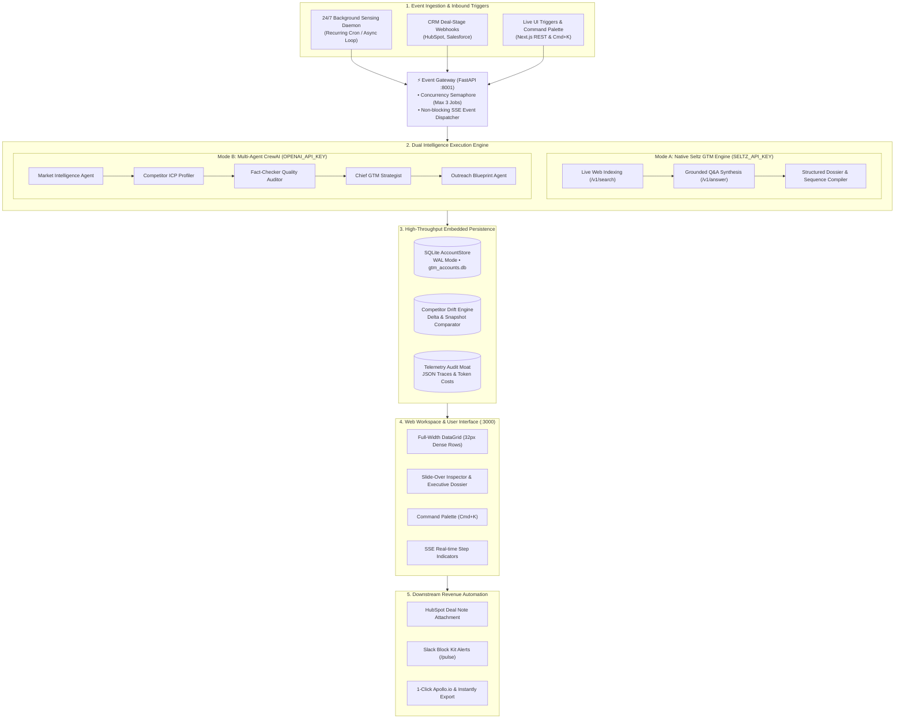

<div align="center">

# Pulse: Autonomous GTM Operating System
### *Event-Driven Competitive Sensing, Fact-Grounded Intelligence, and Closed-Loop Revenue Execution*

<br/>

[](https://www.python.org/)
[-111827?style=flat-square&logo=python&logoColor=white)](https://github.com/astral-sh/uv)
[](https://nextjs.org/)
[](https://fastapi.tiangolo.com)
[](https://seltz.ai)
[](https://crewai.com)
[](https://www.sqlite.org/)
[](tests/)
[](LICENSE)

<br/>

**Pulse** is a distributed, event-driven Go-To-Market (GTM) intelligence system designed to eliminate manual market research and unverified competitive assertions. Built on a resilient **Dual-Engine Architecture** (Native Seltz AI web indexing + optional CrewAI multi-agent reasoning) and paired with an ultra-dense, keyboard-driven Next.js 14 workspace, Pulse continuously senses competitor shifts 24/7, audits facts against live web citations, tracks price and feature drift in SQLite, and automates downstream CRM, Slack, and outbound revenue workflows.

</div>

---

## Table of Contents

- [System Thesis & Problem Statement](#system-thesis--problem-statement)
- [Architecture & Data Flow](#architecture--data-flow)
- [Key Engineering Highlights](#key-engineering-highlights)
  - [1. Dual Intelligence Core (Seltz Native vs. Multi-Agent)](#1-dual-intelligence-core)
  - [2. Anti-Hallucination Citation Verification Moat](#2-anti-hallucination-citation-verification-moat)
  - [3. Concurrency Semaphore & Asynchronous SSE Streaming](#3-concurrency-semaphore--asynchronous-sse-streaming)
  - [4. Embedded SQLite Persistence with WAL Mode](#4-embedded-sqlite-persistence-with-wal-mode)
  - [5. Resilient Indexing with Circuit Breaker & Connection Pooling](#5-resilient-indexing-with-circuit-breaker--connection-pooling)
- [Web Workspace & User Interface](#web-workspace--user-interface)
- [Quick Start Guide](#quick-start-guide)
  - [Prerequisites](#prerequisites)
  - [1. Backend Deployment (`uv`)](#1-backend-deployment-uv)
  - [2. Frontend Deployment (`Next.js 14`)](#2-frontend-deployment-nextjs-14)
  - [3. Testing](#3-testing)
  - [4. Environment Credentials](#4-environment-credentials)
- [REST API & SSE Event Specification](#rest-api--sse-event-specification)
- [Directory Topology](#directory-topology)
- [License](#license)

---

## System Thesis & Problem Statement

Enterprise Go-To-Market and product marketing teams face three architectural bottlenecks:

1. **Market Intelligence Latency**: Competitor pricing shifts, feature launches, and hiring surges occur continuously, but market intelligence sits trapped in static quarterly PDF decks that decay immediately.
2. **Hallucination Risk in Enterprise Deals**: Off-the-shelf LLMs frequently invent nonexistent compliance accreditations, inaccurate pricing tiers, or fictitious integrations, destroying sales credibility during late-stage enterprise evaluations.
3. **Workflow Disconnect**: Intelligence is isolated in silos rather than automatically feeding active CRM pipeline deals, sales battlecard channels, and SDR outbound cadences.

**Pulse addresses these failure modes by combining sub-second machine web indexing, automated source-URL verification, historical snapshot diffing, and closed-loop revenue triggers.**

---

## Architecture & Data Flow



---

## Key Engineering Highlights

### 1. Dual Intelligence Core
Pulse decouples web knowledge acquisition from model reasoning:
* **Native Seltz Engine (`SeltzGTMEngine`)**: Executes 100% against Seltz AI (`seltz.Seltz.search()` and `seltz.Seltz.answer()`). Directly extracts live competitor pricing, ICP pain points, objection counters, and 3-step sequences with zero external LLM token overhead (~3-8s execution).
* **Multi-Agent Orchestration (`GtmIntelligenceCrew`)**: When `OPENAI_API_KEY` is provided, Pulse activates a 5-agent sequential pipeline role-playing across market research, ICP profiling, fact checking, positioning strategy, and cold email copywriting (~25-45s execution).
* **Offline Resiliency**: Includes an automatic fallback to DuckDuckGo Search (`ddgs`) when running in air-gapped or keyless developer environments.

### 2. Anti-Hallucination Citation Verification Moat
Every report undergoes strict grounding validation via `PulseEvaluator`:
* Extracts all claims and matches them against source URLs retrieved during the live web crawl.
* Computes an **Overall Grade (`A`, `B`, `C`, `F`)**, a numerical **Grounding Score ($0.0 \to 1.0$)**, and counts verified versus unverified citations.
* Reports scoring below threshold are flagged with warning indicators before reaching sales representatives.

### 3. Concurrency Semaphore & Asynchronous SSE Streaming
* **Throttling**: A global `asyncio.Semaphore(3)` bounds concurrent agent runs, preventing rate limits and host memory saturation.
* **Non-Blocking SSE**: `POST /api/v1/scan/jobs` returns `202 Accepted` with a `job_id` within 10ms. Clients subscribe to `GET /api/v1/scan/jobs/{job_id}/stream` (`text/event-stream`), receiving progressive execution updates (`step_start`, `tool_call`, `fact_audit`, `job_completed`) with zero HTTP 504 timeouts.

### 4. Embedded SQLite Persistence with WAL Mode
* Eliminates heavy external database dependencies by embedding SQLite with Write-Ahead Logging (`PRAGMA journal_mode=WAL; PRAGMA busy_timeout=5000;`).
* Guarantees concurrent read/write isolation and safe teardown on Windows without file locking (`WinError 32`).
* Automated delta tracking in `CompetitorDriftEngine` detects additions/removals across `key_features`, `tech_stack_signals`, and `pricing_summary`.

### 5. Resilient Indexing with Circuit Breaker & Connection Pooling
* Custom `CircuitBreaker` in `seltz_tool.py` isolates API failures (trips to `OPEN` after 3 consecutive errors; probes via `HALF_OPEN` after a 60s cooldown).
* Persistent `httpx.Client` pool with strict timeouts (5s connect / 15s read) to prevent socket leaks during concurrent crawls.

---

## Web Workspace & User Interface

The frontend is built with Next.js 14 and Tailwind CSS, focusing on information density and keyboard ergonomics:

* **Full-Width DataGrid**: High-density 32px row heights displaying 25+ target accounts above the fold, monospace tabular metrics, inline 40px ICP fit micro-bars, and multi-row selection for bulk operations.
* **Slide-Over Inspector & Executive Dossier**: Inspecting an account opens a slide-over panel with an interactive backdrop. The panel can be expanded to full-screen view (`Maximize2`) for multi-column executive reviews.
* **Five Intelligence Views**:
  1. **Overview & ICP Profile**: ARR, headcount, verified decision makers, and operational pain points.
  2. **Battlecard Studio**: Key differentiators, win themes, discovery landmines, and 1-click objection copy.
  3. **Drift Feed**: Chronological delta signals tracking pricing modifications, hiring surges, and feature changes.
  4. **Outreach Cadence**: 3-step cold outbound sequence with 1-click Apollo.io CSV export.
  5. **Telemetry & Audit**: Grounding scores, source citation links, execution latency, and USD token costs.
* **Keyboard-First Controls**: `J` / `K` (navigate rows), `Enter` (inspect account), `Esc` (close drawer), and `⌘K` / `Ctrl+K` (command palette).

---

## Quick Start Guide

### Prerequisites
* Python 3.11+
* Node.js 18+ and npm
* [uv](https://github.com/astral-sh/uv) (ultra-fast Python package manager)

---

### 1. Backend Deployment (`uv`)

```bash
# Clone the repository
git clone https://github.com/Saumojit30/Pulse.git
cd Pulse

# Sync Python virtual environment & dependencies
uv sync

# Launch the FastAPI backend on dedicated port 8001
uv run python main.py
```
* Interactive API Documentation: **`http://127.0.0.1:8001/docs`**
* Health Check Endpoint: **`http://127.0.0.1:8001/health`**

---

### 2. Frontend Deployment (`Next.js 14`)

In a separate terminal:

```bash
cd frontend

# Install dependencies and start development server
npm install
npm run dev
```
* Frontend Workspace: **`http://localhost:3000`**

---

### 3. Testing

Execute the automated test suite covering API gateways, drift comparison, circuit breakers, and Seltz tool resilience:

```bash
uv run pytest tests/
```

---

### 4. Environment Credentials

Copy `.env.example` to `.env`:
```bash
cp .env.example .env
```

```env
# Seltz Web Indexing API Key (https://seltz.ai) - Enables live web indexing
SELTZ_API_KEY=your_seltz_api_key_here

# LLM Provider Key (Optional: enables CrewAI multi-agent reasoning mode)
OPENAI_API_KEY=your_openai_api_key_here

# Slack Webhook URL (Optional: enables real-time deal alerts)
SLACK_WEBHOOK_URL=https://hooks.slack.com/services/...
```

> **Zero-Key Execution**: Pulse includes an automatic search fallback (DuckDuckGo) and heuristic synthesis so you can evaluate the entire application immediately without external API accounts.

---

## REST API & SSE Event Specification

The backend runs on port `8001` (preventing collisions with port `8000` services):

### 1. Asynchronous Scan Job Creation
```http
POST /api/v1/scan/jobs
Content-Type: application/json

{
  "target_domain": "datadog.com",
  "mode": "deep",
  "force_refresh": false
}
```
**Response (`202 Accepted`):**
```json
{
  "job_id": "job_3810f6029762",
  "target_domain": "datadog.com",
  "mode": "deep",
  "status": "QUEUED",
  "created_at": "2026-09-01T10:15:00.000Z"
}
```

### 2. Real-Time Server-Sent Events Stream
```http
GET /api/v1/scan/jobs/{job_id}/stream
Accept: text/event-stream
```
**Live Stream Payloads:**
```text
event: step_start
data: {"step": "web_intelligence", "message": "Seltz Web Indexing live search for 'datadog.com'..."}

event: tool_call
data: {"tool": "SeltzSearchTool", "query": "datadog.com", "citations_extracted_count": 4, "citations": ["https://datadog.com/pricing"]}

event: fact_audit
data: {"grade": "A", "overall_score": 0.95, "grounding_score": 0.96, "cited_urls_count": 4}

event: job_completed
data: {"status": "SUCCESS", "target_domain": "datadog.com", "quality_grade": "A", "grounding_score": 0.96}
```

### 3. Persistent Account Store Endpoints
* `GET /api/v1/accounts`: Retrieve all accounts saved in SQLite with ICP scores, battlecards, and decision makers.
* `POST /api/v1/accounts`: Insert or update a target account profile.
* `DELETE /api/v1/accounts/{id}`: Delete an account.
* `GET /api/v1/drift/{domain}`: Fetch competitor pricing, hiring, and tech-stack drift signals.
* `GET /api/v1/audit/logs`: Paginated execution traces with token counts and estimated USD cost metrics.

---

## Directory Topology

```
Pulse/
├── main.py                                # Backend entrypoint (:8001)
├── pyproject.toml                         # uv dependencies and pytest configuration
├── README.md                              # Technical system documentation
├── .gitignore                             # Secret, database, and build artifact exclusions
├── .env.example                           # Template environment configuration
├── src/
│   └── gtm_intelligence/
│       ├── api/
│       │   └── server.py                  # FastAPI Event Gateway, SSE streaming, CRUD
│       ├── engine/
│       │   └── seltz_engine.py            # Native Seltz GTM Intelligence Engine
│       ├── storage/
│       │   ├── account_store.py           # SQLite AccountStore (WAL mode)
│       │   └── drift_engine.py            # Competitor Drift & Delta Engine
│       ├── tools/
│       │   └── seltz_tool.py              # Seltz Web Indexing & Circuit Breaker
│       ├── crew.py                        # CrewAI Multi-Agent Orchestrator
│       ├── workers/
│       │   └── daemon.py                  # 24/7 Background Sensing Daemon
│       ├── evaluation/
│       │   └── evaluator.py               # Fact Grounding & Quality Scorecard
│       ├── logging/
│       │   └── audit_logger.py            # JSON Audit Traces & Token Cost Tracker
│       ├── integrations/
│       │   ├── crm_sync.py                # HubSpot / Salesforce Deal Sync
│       │   ├── slack_bot.py               # Slack Block Kit Slash Command Bot
│       │   └── outbound_sync.py           # Apollo.io / Instantly Exporter
│       └── models/
│           └── gtm_models.py              # Pydantic Schemas & Domain Types
├── frontend/                              # Next.js 14 Production Workspace
│   ├── src/
│   │   ├── app/
│   │   │   ├── globals.css                # Monochrome Design Tokens
│   │   │   ├── layout.tsx                 # Root layout & font configuration
│   │   │   └── page.tsx                   # Main workspace page
│   │   ├── components/
│   │   │   ├── GtmWorkspace.tsx           # Workspace Coordinator & State
│   │   │   ├── Topbar.tsx                 # System Telemetry & Quick Actions
│   │   │   ├── DataGrid.tsx               # Full-Width Ultra-Dense Table
│   │   │   ├── InspectorDrawer.tsx        # Slide-over & Executive Dossier View
│   │   │   └── CommandPalette.tsx         # Command Palette (Cmd+K)
│   │   ├── lib/
│   │   │   └── api.ts                     # REST & SSE Streaming Client (:8001)
│   │   └── types/
│   │       └── gtm.ts                     # TypeScript Type Definitions
│   ├── package.json
│   └── tailwind.config.ts
└── tests/                                 # 27 unit, integration, and resilience test suites
```

---

## License

Distributed under the MIT License. See [`LICENSE`](LICENSE) for details.

<div align="center">
<b>Pulse — Autonomous GTM Operating System</b>
</div>
